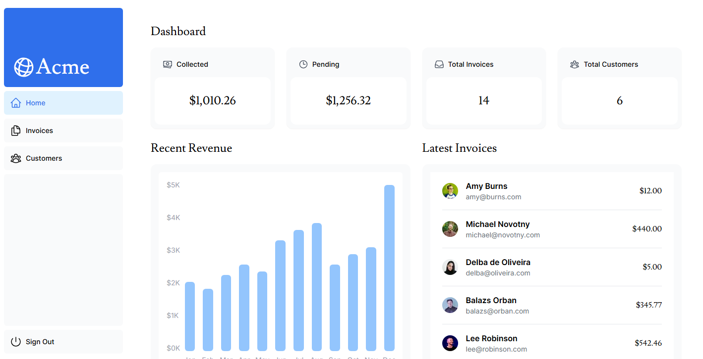

# Next.js Dashboard App

A modern and responsive dashboard application built using [Next.js](https://nextjs.org/), showcasing full-stack capabilities, including authentication, data fetching, and dynamic rendering.

---

## 🚀 Features

- **Authentication:** Secure user login with credentials.
- **Dynamic Routing:** Efficient and SEO-friendly navigation.
- **Server-Side Rendering (SSR):** Fetch data securely from the server.
- **Incremental Static Regeneration (ISR):** Boost performance with real-time static updates.
- **Responsive Design:** Optimized for all screen sizes.
- **Database Integration:** Connects to PostgreSQL for managing data.
- **Tailwind CSS:** Utility-first styling for a sleek design.

---

## 🛠️ Technologies

- [Next.js](https://nextjs.org/) - React framework for building server-rendered and static web applications.
- [Tailwind CSS](https://tailwindcss.com/) - Utility-first CSS framework for styling.
- [PostgreSQL](https://www.postgresql.org/) - Relational database system.
- [NextAuth.js](https://next-auth.js.org/) - Authentication for Next.js applications.
- [Vercel](https://vercel.com/) - Deployment platform for modern web applications.

---

## 📚 Learning Objectives

This project is part of the official [Next.js Learn tutorial](https://nextjs.org/learn/dashboard-app). It covers:

1. Setting up a full-stack app.
2. Implementing authentication and authorization.
3. Fetching and mutating data securely.
4. Optimizing performance with server-side and static rendering.
5. Building reusable components with Tailwind CSS.
